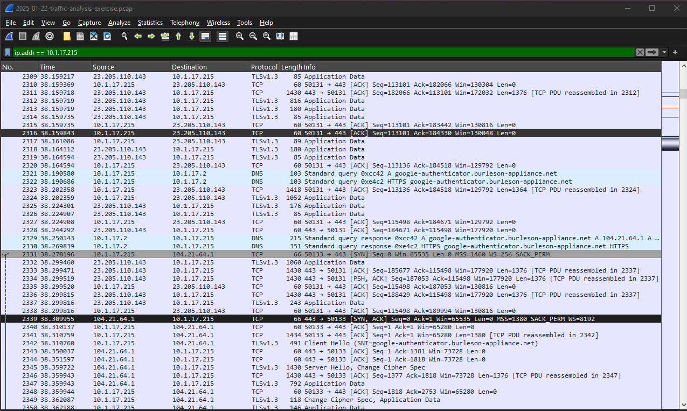
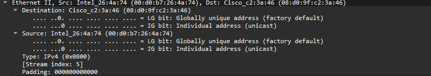
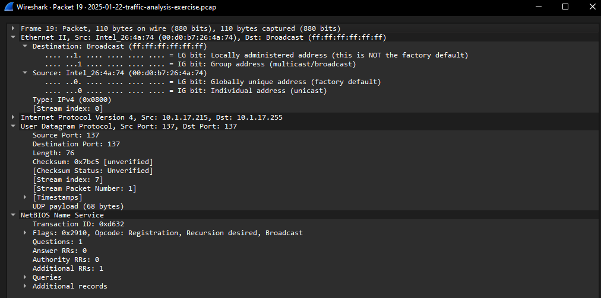
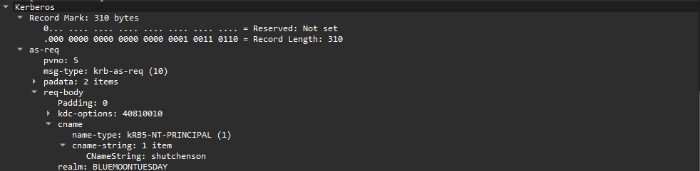
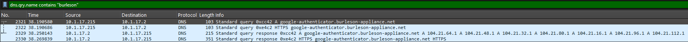
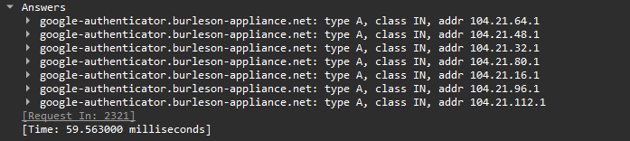

# Incident Report: Fake Google Authenticator Infection

**Source capture:** [malware-traffic-analysis.net, 2025-01-22 exercise](https://www.malware-traffic-analysis.net/2025/01/22/index.html)
**Analyst:** [Sarvarbek]
**Date analyzed:** [6/6/2026]
**Tool:** Wireshark

---

## What happened

Someone at the company searched for Google Authenticator. They clicked a fake site and downloaded a bad file. Their computer got infected. This report shows which computer it was, who was on it, the fake site, and where the malware was sending data.

## The network

- The network is 10.1.17.x.
- The router is 10.1.17.1.
- The company server is 10.1.17.2. Its name is WIN-GSH54QLW48D.
- The Windows domain is BLUEMOONTUESDAY.

## What I found

| Question | Answer |
|---|---|
| Infected computer (IP) | 10.1.17.215 |
| Its hardware ID (MAC) | 00:d0:b7:26:4a:74 |
| Its name | DESKTOP-L8C5GSJ |
| The user | shutchenson |
| Fake site | google-authenticator.burleson-appliance.net |
| Where the malware talked (C2) | 104.21.16.1, 104.21.32.1, 104.21.48.1, 104.21.64.1, 104.21.80.1, 104.21.96.1, 104.21.112.1 |

## How I found it

**The infected computer.** One computer did almost all the talking. That was 10.1.17.215. It was not the router or the server. So it was a regular work PC. I used the filter `ip.addr == 10.1.17.215`.

**The hardware ID.** When a PC sends a packet, its hardware ID is in the Ethernet part. I picked a packet the PC sent and read the Source line.

**The name.** When a PC starts up, it announces its name on the network. The NBNS packets showed it. Filter: `nbns`.

**The user.** Windows logins use Kerberos. The login request holds the username in a field called CNameString. One name ends in a dollar sign. That is the computer, not a person, so I skipped it. The name with no dollar sign is the user. Filter: `kerberos`.

**The fake site.** The PC looked up google-authenticator.burleson-appliance.net. Read a web address right to left. The real owner is burleson-appliance.net. That has nothing to do with Google. The "google-authenticator" part is just a label anyone can stick on the front. So it is fake. Filter: `dns.qry.name contains "burleson"`.

**Where the malware talked.** The fake site pointed to seven addresses, all starting with 104.21. Those belong to Cloudflare. Cloudflare is a real service that hides where a site is actually hosted. The attacker used it to stay hidden and to blend in with normal traffic.

## What I checked and ruled out

- The PC talked to v20.events.data.microsoft.com. The names looked long and strange. But that is just normal Windows sending data to Microsoft. Not a threat.
- The 104.21 addresses are Cloudflare. Many real sites use them too. So blocking those IPs is not very useful on its own. The fake domain is the better thing to block.

## Indicators (IOCs)

- Domain: google-authenticator.burleson-appliance.net
- C2 IPs: 104.21.16.1, 104.21.32.1, 104.21.48.1, 104.21.64.1, 104.21.80.1, 104.21.96.1, 104.21.112.1

## What I'd do next

- Take 10.1.17.215 off the network.
- Assume the user's password was stolen. Reset it.
- Block the fake domain.
- Send it up to identify the malware and decide if the PC needs a wipe.
